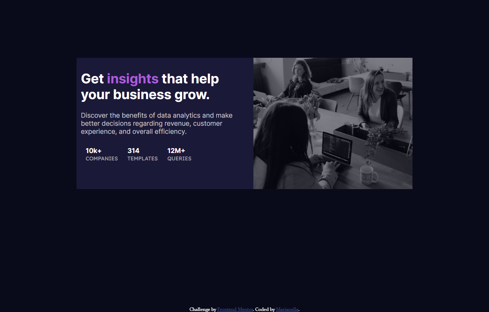

# Frontend Mentor - Stats preview card component solution

This is a solution to the [Stats preview card component challenge on Frontend Mentor](https://www.frontendmentor.io/challenges/stats-preview-card-component-8JqbgoU62). Frontend Mentor challenges help you improve your coding skills by building realistic projects. 

## Table of contents

- [Overview](#overview)
  - [The challenge](#the-challenge)
  - [Screenshot](#screenshot)
  - [Links](#links)
- [My process](#my-process)
  - [Built with](#built-with)
  - [What I learned](#what-i-learned)
  - [Continued development](#continued-development)
  - [Useful resources](#useful-resources)
- [Author](#author)

## Overview

### The challenge

Users should be able to:

- View the optimal layout depending on their device's screen size

### Screenshot

### Links

- Live Site URL: [live site URL](https://marianellag1.github.io/Stats-Card/)

## My process
I really like setting up all file and folders up. Looking through what is required and start forming an idea of how I can start the challenge. As well as having side by side vs code with browser to visually see how the challenge is looking.

### Built with

- Semantic HTML5 markup
- CSS custom properties
- Flexbox
- CSS Grid

### What I learned

Ever since learning about bootstrap, I have tried to do almost all challenges with that framework. It's super helpful, but I have wanted 
to for some time try to make my own columns and css without the help of bootstrap. I think I did a pretty good job. I am still learning and
figuring out all the syntax and how it works and may go along, but this all in all was a great accomplishment for me.

### Continued development

As the user can see, I couldn't make the image with the violet tint. I will have to do more research on that, as well as how I can format challenge into different screen sizes, so viewers can get full experience on any device.

### Useful resources

- [resource 1](https://www.w3schools.com/) - W3Schools is very helpful when it comes to allowing me to visually see codes that I can implement on my own code, and try it out before putting it on my code.
- [resource 2](https://www.google.com) - I searched too many sites, but google was there for me to give me the most revelant help I needed, even if what I put in search made no sense.

## Author

- GitHub - [Marianella](https://github.com/Marianellag1)
- Frontend Mentor - [@Mgamboa](https://www.frontendmentor.io/profile/Marianellag1)

